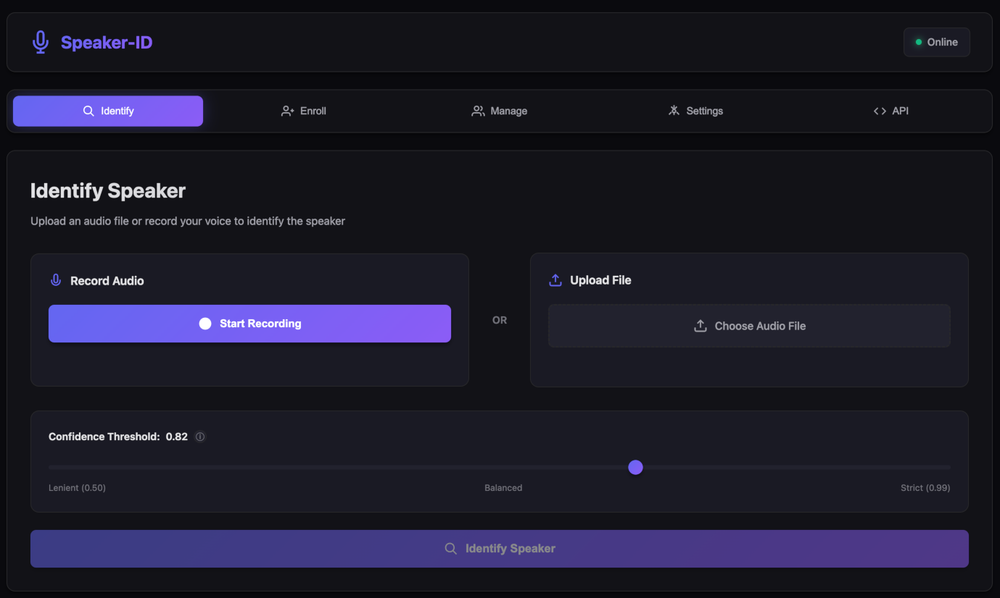
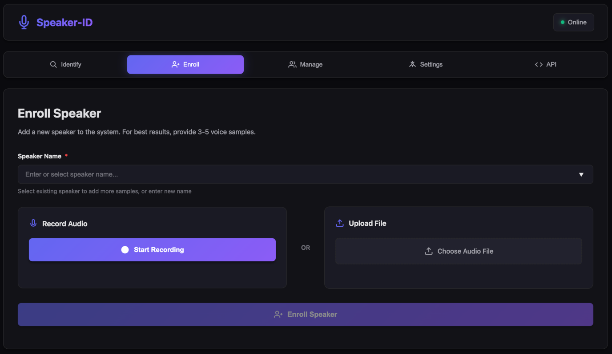

# Speaker-ID 🎤

> **Add personalized voice recognition to Home Assistant Assist Pipeline**

Give your Home Assistant voice assistant the ability to recognize who's speaking! Speaker-ID integrates seamlessly with the **Home Assistant Assist Pipeline** to enable truly personalized voice-controlled smart home experiences.

[](https://opensource.org/licenses/MIT)
[](https://www.python.org/downloads/)

---

## 🏠 What is Speaker-ID?

Speaker-ID is a lightweight AI service that identifies people by their voice - think facial recognition, but for voices! It's **specifically designed to work with Home Assistant's Assist Pipeline**, enabling your voice assistant to know who's speaking and respond accordingly.

### Primary Use Case: Home Assistant Assist Pipeline

Speaker-ID enhances your Home Assistant voice assistant by adding speaker identification:

```
"Hey Jarvis, good morning"
  → Speaker-ID identifies it's Alice
  → "Good morning Alice! It's 7:30 AM. Would you like me to start your morning routine?"
```

**Key Features:**
- **Personalized responses**: Different greetings, news, music for each family member
- **Smart automation**: Lights, climate, and scenes adjust based on who's speaking
- **Voice-based access control**: Only authorized voices can unlock doors or arm security
- **Multi-user calendar/schedules**: "What's on my calendar?" gets the right person's schedule
- **Room presence tracking**: Know who's in which room based on voice interactions

### How It Works (Simple Version)

1. **Enrollment**: Each family member says a few sentences to train the system
2. **Integration**: Connect Speaker-ID to your Home Assistant Assist Pipeline
3. **Voice Commands**: When anyone speaks to your voice assistant, Speaker-ID identifies them
4. **Personalization**: Home Assistant uses this info to provide personalized responses and automations

**100% local - no cloud required!** All voice processing happens on your network.

---

## 🚀 Quick Start for Home Assistant Users

**Don't worry if you're not familiar with Python!** We provide simple Docker-based installation that works on any system.

### Prerequisites

- A computer/server running Docker (Raspberry Pi 4, NAS, or any Linux machine)
- Home Assistant installation
- Microphone or voice recordings

### Option 1: Docker Compose (Recommended)

This is the easiest way to get started. It installs both Speaker-ID and the required database.

1. **Create a directory and download the compose file**:
   ```bash
   mkdir speaker-id
   cd speaker-id
   curl -O https://raw.githubusercontent.com/YOUR-REPO/speaker-id/main/docker/compose.yaml
   ```

2. **Start the services**:
   ```bash
   docker compose up -d
   ```

3. **Verify it's running**:
   ```bash
   curl http://localhost:8080/health
   ```

   You should see: `{"status":"ok"}`

That's it! The service is now running on port 8080.

**Note**: The AI model is pre-downloaded during Docker build, so the service is ready immediately with no first-request delays.

### Option 2: Docker (Manual)

If you prefer more control or already have a Qdrant database:

1. **Start Qdrant database** (if you don't have one):
   ```bash
   docker run -d -p 6333:6333 --name qdrant qdrant/qdrant
   ```

2. **Start Speaker-ID**:
   ```bash
   # Use Resemblyzer (default - faster, lower memory)
   docker run -d \
     -p 8080:8080 \
     -e QDRANT_URL=http://qdrant:6333 \
     --name speaker-id \
     --link qdrant \
     ghcr.io/identitry/speaker-id:latest

   # Or use ECAPA model (more accurate)
   docker run -d \
     -p 8080:8080 \
     -e QDRANT_URL=http://qdrant:6333 \
     -e USE_ECAPA=true \
     --name speaker-id \
     --link qdrant \
     ghcr.io/identitry/speaker-id:latest
   ```

---

## 📱 Using the Service

### Web Interface

**Modern, user-friendly interface** with dark blue/violet theme.

Open your browser to `http://localhost:8080`

**Features**:
- 🎯 **Identify** - Upload or record audio to identify speakers
- ➕ **Enroll** - Add new speakers with multiple voice samples
- 👥 **Manage** - View and delete enrolled speakers
- ⚙️ **Settings** - System configuration and maintenance
- 📡 **API** - Documentation and code examples

**Key Features**:
- Record directly from microphone or upload files
- Adjustable confidence threshold with slider
- Visual results with confidence bars
- Bulk speaker management
- Real-time status indicators

See [Web Interface Guide](docs/web-interface.md) for complete details.

**Screenshots**




### Command Line (for automation)

**Enroll a new speaker**:
```bash
curl -F "file=@alice_voice.wav" "http://localhost:8080/api/enroll?name=Alice"
```

**Identify a speaker**:
```bash
curl -F "file=@unknown_voice.wav" "http://localhost:8080/api/identify?threshold=0.82"
```

Response example:
```json
{
  "speaker": "Alice",
  "confidence": 0.91,
  "topN": [
    {"name": "Alice", "score": 0.91},
    {"name": "Bob", "score": 0.65}
  ]
}
```

### API Documentation

Once running, visit:
- **Interactive API docs**: http://localhost:8080/docs
- **Alternative docs**: http://localhost:8080/redoc

---

## 🔌 Home Assistant Integration

### Recommended: Assist Pipeline Integration

**This is the primary integration method** - connect Speaker-ID directly to your Home Assistant voice assistant!

Speaker-ID works seamlessly with Home Assistant's Assist Pipeline to identify who's speaking during voice interactions. This enables:

- **Natural conversations**: "Hey Jarvis, turn on my lights" → automatically turns on the right person's lights
- **Personalized responses**: Each family member gets their own greetings, music, calendar, etc.
- **Voice enrollment**: Just say "enroll my voice" to add yourself to the system
- **Multi-room tracking**: Know who's in each room based on voice interactions

**Quick Setup Example:**

```yaml
# configuration.yaml
assist_pipeline:

rest_command:
  identify_speaker_assist:
    url: "http://localhost:8080/api/identify"
    method: POST
    payload: "file={{ audio_file }}&threshold=0.82"

input_text:
  current_speaker:
    name: "Current Speaker"
    initial: "unknown"
```

Then create automations that respond differently based on `input_text.current_speaker`:

```yaml
automation:
  - alias: "Personalized Good Morning via Voice"
    trigger:
      - platform: conversation
        command: "good morning"
    action:
      - choose:
          - conditions:
              - condition: state
                entity_id: input_text.current_speaker
                state: "Alice"
            sequence:
              - service: tts.speak
                data:
                  message: "Good morning Alice! Your calendar shows {{ state_attr('calendar.alice', 'message') }}"
              - service: light.turn_on
                target:
                  entity_id: light.bedroom_alice
                data:
                  brightness_pct: 50

          - conditions:
              - condition: state
                entity_id: input_text.current_speaker
                state: "Bob"
            sequence:
              - service: tts.speak
                data:
                  message: "Good morning Bob! Traffic to work is {{ states('sensor.commute_time') }} minutes"
```

**📖 Complete Assist Pipeline guide: [docs/ha-integration.md](docs/ha-integration.md)**

### Alternative Integration Methods

If you're not using the Assist Pipeline, you can also integrate via:
- **REST Commands**: Direct API calls from automations
- **RESTful Sensors**: Monitor enrolled speakers
- **Node-RED**: Visual workflow programming

See the [full integration guide](docs/ha-integration.md) for all methods and detailed examples.

---

## ⚙️ Configuration

### Environment Variables

| Variable | Default | Description |
|----------|---------|-------------|
| `QDRANT_URL` | `http://localhost:6333` | Qdrant database connection |
| `USE_ECAPA` | `false` | Use advanced ECAPA model (more accurate, slower) |
| `AUDIO_ENHANCEMENT` | `true` | Master switch: enable all audio preprocessing |
| `SELECT_BEST_SEGMENT` | `true` | Select most energetic 3-second segment |
| `SCORE_CALIBRATION` | `true` | Calibrate similarity scores for better discrimination |
| `MIN_AUDIO_DURATION` | `1.0` | Minimum audio duration in seconds |
| `SAMPLE_RATE` | `16000` | Audio sample rate (16kHz recommended) |
| `DEFAULT_THRESHOLD` | `0.82` | Confidence threshold (0-1, higher = stricter) |
| `LOG_LEVEL` | `INFO` | Logging verbosity (DEBUG/INFO/WARNING) |

### Choosing a Model

The Docker image includes **both models** - you choose which one to use at runtime with the `USE_ECAPA` environment variable.

**Resemblyzer** (Default: `USE_ECAPA=false`):
- ✅ Faster inference (~100ms)
- ✅ Lower memory usage (~500 MB)
- ✅ Good for Raspberry Pi
- ✅ Good accuracy for most use cases
- ⚠️ Slightly less accurate than ECAPA

**ECAPA-TDNN** (Set `USE_ECAPA=true`):
- ✅ Significantly more accurate
- ✅ Better with noisy audio
- ✅ Better discrimination between similar voices
- ⚠️ Requires more CPU/RAM (~1.5 GB)
- ⚠️ Slower inference (~300ms)

**Switch models anytime:**
```bash
# Stop current container
docker stop speaker-id && docker rm speaker-id

# Start with ECAPA
docker run -d -e USE_ECAPA=true ... ghcr.io/identitry/speaker-id:latest
```

**Important**: When switching models, you must **re-enroll all speakers** as embeddings are incompatible between models.

---

## 📊 Understanding Confidence Scores

When identifying a speaker, you get a **confidence score** between 0 and 1:

- **0.90+**: Very confident match (same person)
- **0.80-0.89**: Good match (likely the same person)
- **0.70-0.79**: Possible match (similar voice, might be the same person)
- **Below 0.70**: Poor match (probably different person)

**Default threshold is 0.82** - you can adjust based on your needs:
- **Higher threshold** (0.90): Fewer false positives, but might miss correct identifications
- **Lower threshold** (0.70): More identifications, but more false positives

### 🚀 Improving Confidence Scores

If you're getting lower confidence scores than expected, try these improvements:

**1. Use ECAPA-TDNN Model** (Most Impactful)
```bash
# Docker
docker run -e USE_ECAPA=true ...

# Docker Compose
environment:
  - USE_ECAPA=true
```
ECAPA is significantly more accurate than the default Resemblyzer model, especially in noisy conditions.

**2. Enroll Multiple Samples** (Critical)
- Enroll **5-10 samples per person** (not just 1-2)
- Use different sentences and speaking styles
- The system averages all samples to create a more robust profile

**3. Audio Enhancement** (Enabled by Default)
The system automatically applies multiple advanced preprocessing techniques:

- **Voice Activity Detection (VAD)**: Removes silence and non-speech segments
- **Smart Segment Selection**: Automatically selects the best 3-second segment based on energy (for recordings > 3.5s)
- **Normalization**: Ensures consistent volume levels across all recordings
- **Pre-emphasis**: Boosts high frequencies that are critical for speaker characteristics
- **Score Calibration**: Improves discrimination when similarity scores are compressed

Configure these features:
```bash
# All enabled by default
AUDIO_ENHANCEMENT=true        # Master switch for all audio processing
SELECT_BEST_SEGMENT=true      # Select most energetic segment
SCORE_CALIBRATION=true        # Calibrate similarity scores
MIN_AUDIO_DURATION=1.0        # Minimum seconds of speech required
```

**4. Audio Quality Tips**
- Record in a quiet environment
- Speak clearly at normal volume
- Avoid background music or TV
- Use a decent microphone (phone mic is usually fine)
- Ensure 3-5 seconds of actual speech (not just silence)

**5. Re-enroll After System Changes**
If you change models (Resemblyzer ↔ ECAPA), you must re-enroll all speakers as the embeddings are incompatible.

**Expected Confidence Ranges:**
- With ECAPA + 5+ samples: **0.85-0.95** for correct matches
- With Resemblyzer + 3 samples: **0.75-0.88** for correct matches
- Lower scores suggest: similar voices, poor audio quality, or insufficient training samples

---

## 🎯 Best Practices

### Recording Voice Samples

1. **Multiple samples**: Record 3-5 different samples per person
2. **Variety**: Different sentences, tones, and contexts
3. **Quality**: Clear audio, minimal background noise
4. **Length**: At least 3-5 seconds per sample
5. **Natural speech**: Use normal speaking voice, not shouting or whispering

### Audio Format

- **Recommended**: WAV, 16kHz, mono
- **Supported**: MP3, WAV, FLAC (auto-converted)
- **Channels**: Mono preferred, stereo auto-converted

### Privacy & Security

- ✅ All processing happens **locally** - no cloud connection
- ✅ Voice data never leaves your network
- ✅ No audio is stored (only mathematical "fingerprints")
- ⚠️ Backup your Qdrant database to preserve enrolled voices

---

## 🔧 Troubleshooting

### Service won't start

1. Check if port 8080 is available:
   ```bash
   netstat -an | grep 8080
   ```

2. Check Docker logs:
   ```bash
   docker logs speaker-id
   ```

### Identification returns "unknown"

1. **Check confidence score**: It might be just below threshold
2. **Re-enroll**: Try enrolling with more/better voice samples
3. **Lower threshold**: Try `threshold=0.75` instead of 0.82
4. **Check audio quality**: Ensure clear audio with minimal noise

### Poor accuracy

1. **Use ECAPA model**: Set `USE_ECAPA=true`
2. **More training data**: Enroll 5-10 samples per person
3. **Rebuild centroids**: Call `/api/rebuild_centroids` after adding samples
4. **Check audio format**: Ensure 16kHz sample rate

### Getting Help

- 📖 [Full API documentation](docs/api.md)
- 🔍 [Technical details](docs/solution_details.md)
- 🐛 [Report issues](https://github.com/YOUR-REPO/speaker-id/issues)

---

## 📚 Documentation

- **[Web Interface Guide](docs/web-interface.md)** - Using the modern web UI
- **[API Reference](docs/api.md)** - Complete API documentation with examples
- **[Home Assistant Integration](docs/ha-integration.md)** - Detailed integration guide with Assist Pipeline
- **[AI Models Guide](docs/models.md)** - Model selection, performance, and troubleshooting
- **[Solution Details](docs/solution_details.md)** - How it works under the hood
- **[Deployment Guide](docs/deployment.md)** - Production deployment options
- **[Qdrant Database](docs/qdrant.md)** - Database management and backups

---

## 🛠️ For Developers

If you want to contribute or modify the code:

```bash
# Clone the repository
git clone https://github.com/YOUR-REPO/speaker-id.git
cd speaker-id

# Install dependencies
poetry install

# Run tests
poetry run pytest

# Start development server
poetry run uvicorn app.main:APP --reload
```

See [solution_details.md](/docs/solution_details.md) or [CONTRIBUTING.md](CONTRIBUTING.md) for detailed development documentation.

---

## 📈 Monitoring

Speaker-ID includes built-in Prometheus metrics at `/metrics`:

- Request counts and latencies
- Identification success/failure rates
- Per-speaker identification counts

Perfect for Grafana dashboards!

---

## 🗺️ Roadmap

- [x] Core speaker identification
- [x] Docker deployment
- [x] Prometheus metrics
- [x] Web UI for testing
- [ ] Home Assistant Add-on
- [ ] Kubernetes Helm chart
- [ ] Multi-language support
- [ ] Real-time audio streaming
- [ ] Speaker diarization (who spoke when)

---

## 🤝 Contributing

Contributions are welcome! Please:

1. Fork the repository
2. Create a feature branch
3. Make your changes
4. Add tests if applicable
5. Submit a pull request

---

## 📜 License

MIT License - see [LICENSE](LICENSE) for details

---

## 🙏 Acknowledgments

- [Resemblyzer](https://github.com/resemble-ai/Resemblyzer) - Voice encoding
- [SpeechBrain](https://speechbrain.github.io/) - ECAPA-TDNN model
- [Qdrant](https://qdrant.tech/) - Vector database
- [FastAPI](https://fastapi.tiangolo.com/) - API framework

---

**Made with ❤️ for the Home Assistant community**
